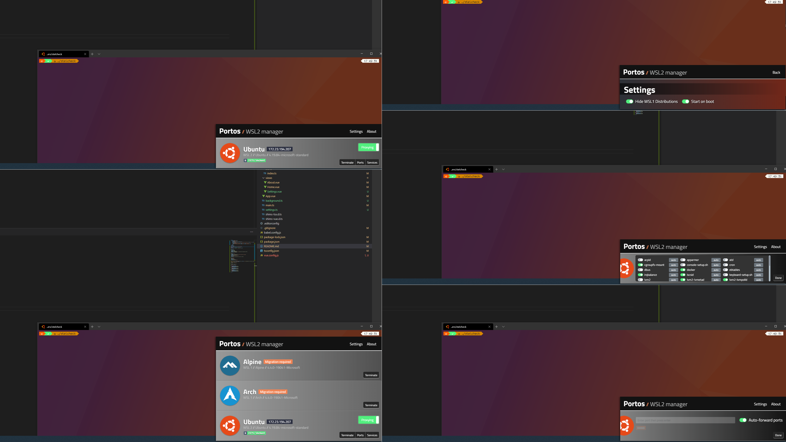

# 

**Current status**: prototype (contributions welcome)

WSL2 manager. Runs as a tray application.

Currently manages:

1. Exposing ports (by detecting exposed ports or configuring port forwarding)
2. Services (auto start services, start stop manually)

### Todo

- [ ] Start on boot: UI implemented but not working
- [ ] Proxying toggle: UI implemented but not working
- [ ] Bubble notification on first start (to show it's running)
- [ ] Right click/exit menu
- [ ] Bug fixing: there are tons
- [ ] Build: it looks like the installed build runs from CLI but not from Windows menu

### Acknowledgements 

Created my free logo at LogoMakr.com (logomakr.com/9Rc7Jh).
Color palette: https://coolors.co/2d3142-bfc0c0-ffffff-52ef7f-ef8354-ed4054-4f5d75
